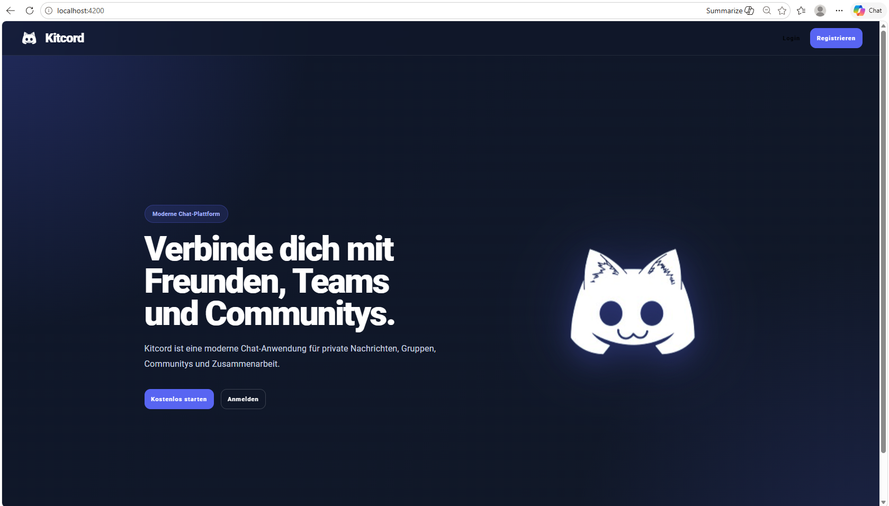
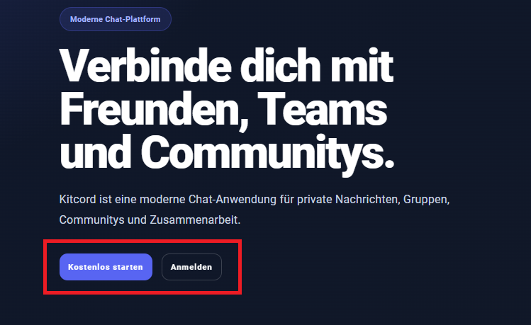
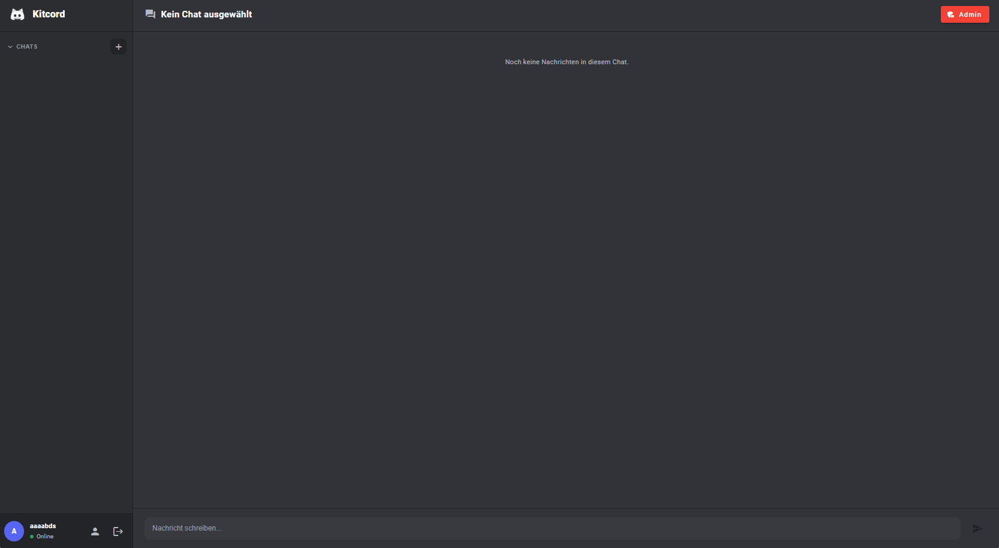
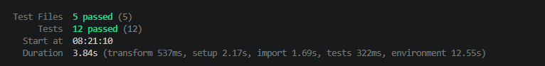
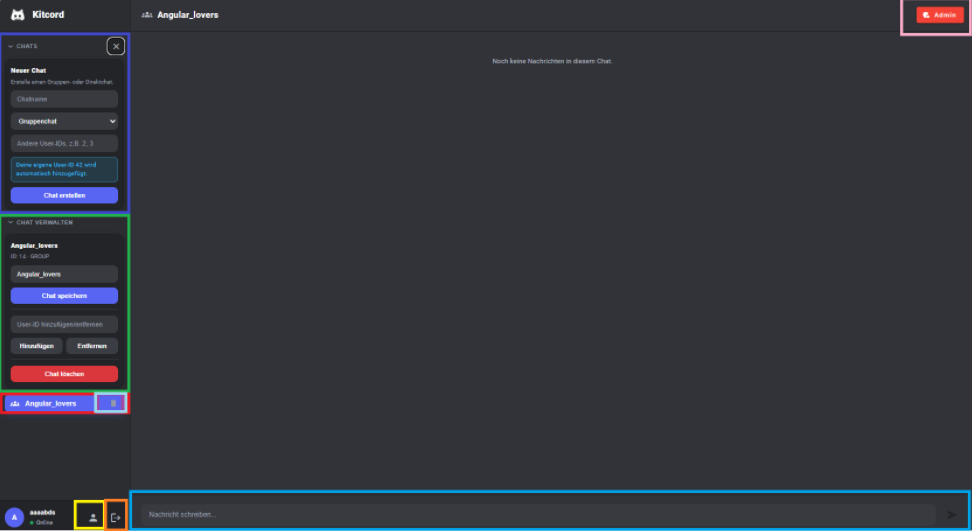
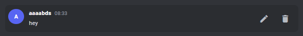
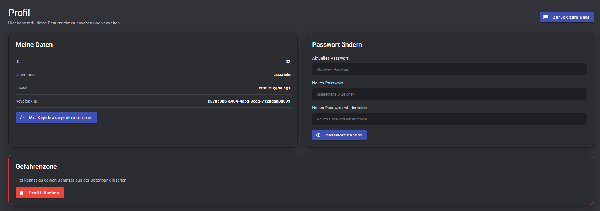
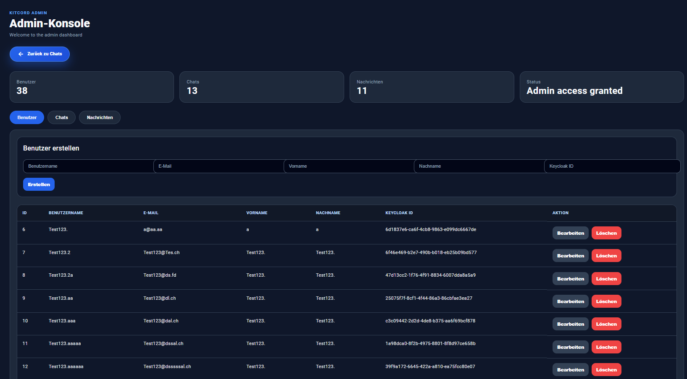

# Kitcord Frontend

## Projektkonfiguration

---

# 1. Allgemeine Informationen

## Projektname

Kitcord Frontend

## Technologie

* Angular
* TypeScript
* Angular Material
* OAuth2 / OpenID Connect
* Keycloak
* npm

## Authentifizierung

Login über Keycloak mit JWT Access Token.

## Frontend URL

```text
http://localhost:4200
```

## Backend API URL

```text
http://localhost:9090
```

---

# 2. Voraussetzungen

# 2. Voraussetzungen

Folgende Software muss installiert sein:

- Node.js
- npm
- Angular CLI
- Git
- laufendes Backend
- laufender Keycloak Server

## Entwickler Packages

Für Entwicklung, Tests und Codequalität werden verwendet:

- ESLint
- Angular ESLint
- TypeScript ESLint
- Vitest

---

# 3. Projektstruktur

Das Frontend verwendet folgende Architektur:

```text
Component
↓
Service
↓
HTTP Client
↓
Spring Boot Backend
```

Verwendete Hauptbereiche:

* Login
* Registrierung
* Chat Ansicht
* Nachrichten
* Admin Konsole
* Routing
* Guards
* Rollenbasierte Anzeige

---

# 4. Ports

| Service          | Port |
| ---------------- | ---- |
| Angular Frontend | 4200 |
| Spring Boot API  | 9090 |
| Keycloak         | 8080 |
| PostgreSQL       | 5432 |

---

# 5. Backend Voraussetzung

Das Backend muss vor dem Frontend gestartet sein.

## Backend URL

```text
http://localhost:9090
```

## Backend Start mit PostgreSQL

```bash
mvn spring-boot:run "-Dspring-boot.run.profiles=postgres"
```

## Backend Start mit H2

```bash
mvn spring-boot:run "-Dspring-boot.run.profiles=h2"
```

---

# 6. Keycloak Voraussetzung

Da Änderungen am Keycloak vorgenommen wurden, muss das Realm neu importiert werden. Die Datei liegt im Backendordner im Keycloakordner als json-Datei.
Keycloak muss laufen:

```text
http://localhost:8080
```

## Keycloak starten

```bash
cd C:\Pfad\keycloak-26.6.0\bin
```

```bash
.\kc.bat start-dev --http-port=8080 --bootstrap-admin-username=admin --bootstrap-admin-password=admin
```

## Admin Console

```text
http://localhost:8080/admin
```

---

# 7. Keycloak Konfiguration

## Realm

```text
kitcord
```

## Frontend Client

| Einstellung          | Wert           |
| -------------------- | -------------- |
| Client ID            | kitcord        |
| Client Type          | OpenID Connect |
| Access Type          | Public         |
| Standard Flow        | aktiviert      |
| Direct Access Grants | aktiviert      |

## Redirect URI

Der Angular Login leitet nach Keycloak wieder zurück auf das Frontend.

Empfohlene Redirect URI:

```text
http://localhost:4200/*
```

Oder genauer:

```text
http://localhost:4200/auth/callback
```

## Rollen

Folgende Rollen werden im Frontend verwendet:

```text
ROLE_admin
ROLE_read
ROLE_update
```
Im Code wird ROLE_ entfernt.

### Rollenbasierte Zugriffe

| Rolle       | Zugriff                          |
| ----------- | -------------------------------- |
| admin  | Admin Konsole und Vollzugriff    |
| read   | Chat lesen                       |
| update | Chats und Nachrichten bearbeiten |

---

# 8. Projekt starten

## Repository klonen

```bash
git clone https://github.com/Angelfish67/Kitcord
```

## In Frontend Ordner wechseln

```bash
cd Kitcord/frontend
```

## npm Dependencies installieren

```bash
npm install
```

## Frontend starten

```bash
npm start
```

Falls `npm start` nicht funktioniert:

```bash
ng serve
```

Danach ist das Frontend erreichbar unter:

```text
http://localhost:4200
```

---

# 9. Proxy Konfiguration

Das Frontend kommuniziert über den Angular Proxy mit dem Backend.

Backend Requests werden an diese URL weitergeleitet:

```text
http://localhost:9090
```

Dadurch muss im Frontend nicht jedes Mal die komplette Backend URL verwendet werden.

---

# 10. Login Ablauf

1. Benutzer öffnet das Frontend:

```text
http://localhost:4200
```

2. Benutzer klickt auf Login:
http://localhost:4200/login

3. Benutzer wird zu Keycloak weitergeleitet.
4. Nach erfolgreichem Login kommt der Benutzer zurück zum Frontend.
5. Danach wird der Benutzer zum Chat weitergeleitet:


```text
http://localhost:4200/chat
```

---

# 11. Registrierung

Die Registrierung läuft ebenfalls über Keycloak.

Nach der Registrierung wird der Benutzer wieder zum Frontend weitergeleitet.

---

# 12. Routen

| Route     | Beschreibung  |
| --------- | ------------- |
| /         | Startseite    |
| /login    | Login/Regristrierungs Seite   |
| /chat     | Chat Bereich  |
| /admin    | Admin Konsole |
| /noaccess | Kein Zugriff  |

---

# 13. Rollenbasierte Zugriffe

Das Frontend schützt Seiten über Guards.

Zusätzlich werden Buttons und Bereiche über Rollen ein- oder ausgeblendet.

Beispiele:

* Chat öffnen nur mit Leserechten
* Nachrichten schreiben nur mit Update-Rechten
* Admin Konsole nur mit Admin-Rechten
* Admin Knöpfe wie der Knopf zu /admin oder das Löschen von Chats sehen nur Admins

---

# 14. Tests

Das Projekt enthält Frontend Tests.

## Tests ausführen

```bash
npm test
```


---

# 15. Wichtige Hinweise

* Das Frontend läuft auf Port 4200.
* Das Backend muss vor dem Login erreichbar sein.
* Keycloak muss vor dem Login erreichbar sein.
* Ohne gültigen Access Token sind geschützte Seiten nicht erreichbar.
* Der Client `kitcord` wird für den Frontend Login verwendet.
* Nach erfolgreichem Login wird der Benutzer zum Chat weitergeleitet.
* API Requests werden mit Bearer Token an das Backend gesendet.

---

# 16. Benutzung der App

Dieser Guide erklärt wie man in der App die Funktionen benutzt. Für Adminfunktionen muss man sich bei Keycloak anmelden und dem User im Client Kitcord und Kitcord Backend die Rolle ROLE_admin zuweisen !
Passwort und Username von Keycloak sind "admin".



# Benutzeroberfläche

## Übersicht

Die Anwendung besteht aus mehreren Bereichen, welche unterschiedliche Funktionen innerhalb von Kitcord bereitstellen.

---

# Chat erstellen (dunkelblau)

Dieser Bereich dient zum Erstellen neuer Chats.

## Funktionen

- Chatname eingeben
- Chattyp auswählen (Gruppenchat oder Direktchat)
- Benutzer per User-ID hinzufügen
- Eigene User-ID wird angezeigt
- Chat erstellen

## Zweck

Erstellt einen neuen Chat und fügt die angegebenen Benutzer automatisch hinzu.

---

# Chat verwalten (grün)

Dieser Bereich dient zur Bearbeitung des aktuell ausgewählten Chats.

## Funktionen

- Chatnamen ändern
- Chat speichern
- Benutzer hinzufügen
- Benutzer entfernen
- Chat löschen

## Zweck

Verwaltung bestehender Chats.

---

# Chatliste (rot)

Die Chatliste zeigt alle Chats an, in denen der Benutzer Mitglied ist.

## Funktionen

- Chat auswählen
- Zwischen Chats wechseln
- Aktiven Chat anzeigen
- Als Admin kann man Chats per blau markierten Knopf im roten Bereich löschen

## Zweck

Navigation zwischen verschiedenen Chats und Löschen von Chats.

---

# Benutzerbereich (gelb)

Der Benutzerbereich befindet sich unten links.

## Enthält

- Avatar
- Benutzername
- Online-Status
- Profilbutton

## Zweck

Anzeige der aktuell angemeldeten Person und Zugriff auf Profilinformationen.

---

# Logout (orange)

Der Logout-Button befindet sich neben dem Benutzerbereich.

## Funktion

Meldet den Benutzer von Kitcord und Keycloak ab.

---

# Nachrichteneingabe (hellblau)

Die Nachrichteneingabe befindet sich am unteren Rand des Chatfensters.

## Funktionen

- Nachricht schreiben
- Nachricht absenden

## Zweck

Versenden von Nachrichten im aktuell geöffneten Chat.

---

# Admin Bereich (rosa)

Der Admin Button befindet sich oben rechts.

## Funktion

Öffnet die Admin-Konsole.

## Berechtigung

Nur Benutzer mit folgender Keycloakrolle können diesen Bereich sehen:

```text
ROLE_admin
```

---

# Nachrichten Bearbeiten und Löschen

Nach dem Versenden einer Nachricht kann man via Hover die Optionen Bearbeiten und Löschen der Nachricht sehen:



---
# Bearbeitung und Löschung des Accounts
Hier kann man den Account bearbeiten und löschen:

http://localhost:4200/profile



Die Knöpfe sind selbsterklärend:
- In der Gefahrenzone kann man den Account löschen
- "Mit Keycloak synchronisieren" wird nur für das Login verwendet, jedoch kann man es hier testen ob es funktioniert
- Passwort ändern funktioniert analog wie in den meisten Applikationen
- "Zurück zum Chat" führt zu /chat

---
# Admin Konsole

Auf diese Seite kommt man nur mit der ROLE_admin Zuweisung im Keycloak:

http://localhost:4200/admin


Hier kann man:
- Alle User, Chats und Nachrichten sehen
- User erstellen (wenn man die Keycloak ID hat)
- User Bearbeiten und Löschen

# 17. Entwickler

Projekt im Rahmen von Modul 294 erstellt.
